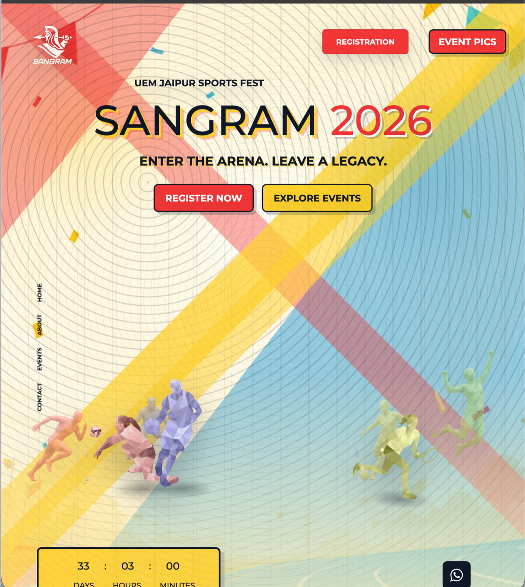
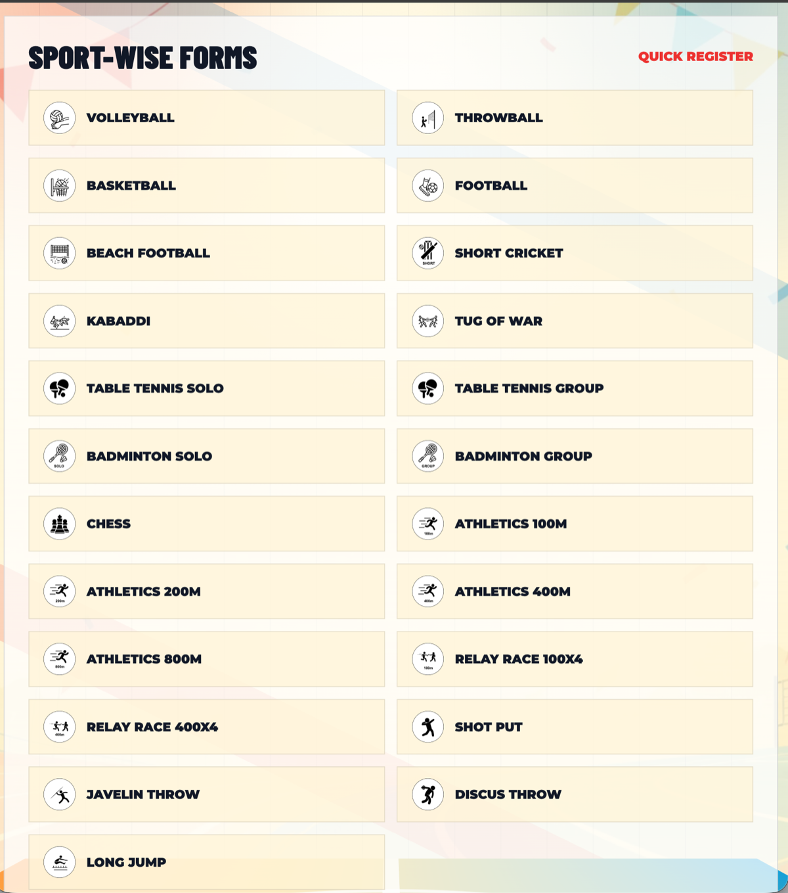
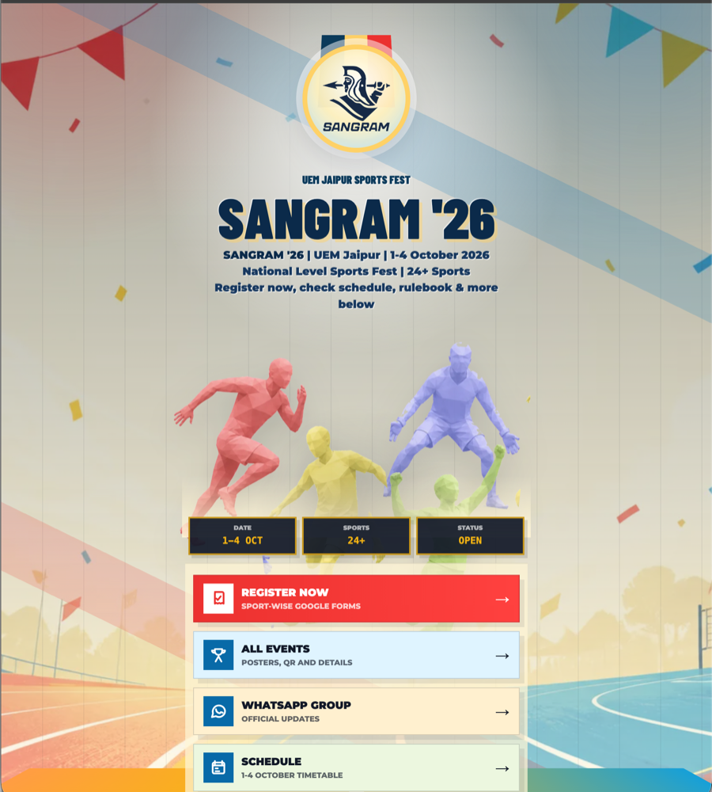

# SANGRAM 2026

A responsive sports fest website built with HTML, CSS, and JavaScript.

The project focuses on a mobile-friendly event experience with landing pages, event sections, registration access, quick links, gallery previews, and static GitHub Pages deployment.

## Live Links

- Website: https://jungjeetsingh9929.github.io/sangram-2k26/
- Quick Links: https://jungjeetsingh9929.github.io/sangram-2k26/links.html

## Preview

## What It Shows

- Responsive frontend implementation
- Mobile-first event page design
- Static website structure and asset organization
- Quick-link page for important actions
- GitHub Pages deployment
- Practical UI work for a real event-style use case

## Tech Stack

- HTML5
- CSS3
- JavaScript
- GitHub Pages

## Local Setup

Clone the repository and open `index.html` in a browser.

This is a static frontend project, so it does not require a backend server for local development.

## Portfolio Notes

This repository is meant to present frontend design, responsive layout, asset handling, and public deployment work in a clean portfolio format.

Event data, registration links, media assets, and contact details should be reviewed before public updates.
